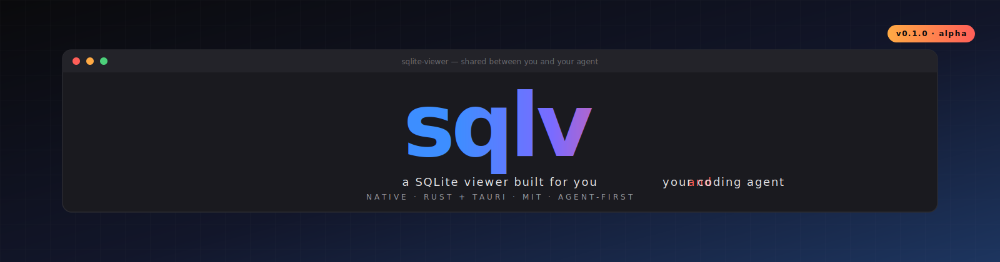

<p align="center">
  
</p>

<h1 align="center">sqlv</h1>

<p align="center">
  <i>The first SQLite viewer designed to be driven by coding agents <b>and</b> humans — at the same time.</i>
</p>

<p align="center">
  <a href="#install"></a>
  <a href="./LICENSE"></a>
  <a href="#for-agents"></a>
  <a href="https://github.com/shizhigu/sqlite-viewer/actions"></a>
  <a href="./docs/DESIGN.md"></a>
</p>

<p align="center">
  <a href="#what-makes-it-different">Why</a> ·
  <a href="#install">Install</a> ·
  <a href="#quick-start">Quick start</a> ·
  <a href="#for-agents">For agents</a> ·
  <a href="#architecture">Architecture</a> ·
  <a href="./docs/DESIGN.md">Design</a> ·
  <a href="#roadmap">Roadmap</a>
</p>

---

## The pitch

Every other SQLite tool was built for one kind of user: a developer sitting at a keyboard. `sqlv` was built for a developer **plus** their coding agent — both inspecting the same database, watching the same results pop into the same window, arguing about the same query.

- **CLI-first, JSON-first.** `sqlv` is a proper command-line tool with stable exit codes, JSON output, and a [SKILL.md](./skills/sqlite-viewer/SKILL.md) that teaches any LLM agent how to drive it safely. `sqlv query ... | jq` just works.
- **A native desktop app that *listens*.** `sqlv push "<SQL>"` sends a query from your terminal into the running desktop window — the SQL appears in the editor, the grid renders the result, and the human next to you sees exactly what the agent just did. Nothing about this flow exists in TablePlus, DB Browser, DataGrid, or `sqlite3`.
- **Fast by default, safe by default.** Databases open read-only until you flip a toggle. The toggle puts a warning strip across the top of the window so you can't forget. Writes from the CLI require an explicit `--write` flag.
- **Pure SQLite.** No support for Postgres or MySQL, ever. We're not another Beekeeper — we're the *best* tool for local SQLite files.

## What makes it different

|   | sqlv | TablePlus / Beekeeper / DBB | sqlite3 CLI |
|---|:---:|:---:|:---:|
| Browse rows, edit cells, run queries | ✅ | ✅ | ❌ |
| JSON-first CLI with stable exit codes | ✅ | ❌ | ⚠️ brittle text |
| Agent skill file (`SKILL.md`) | ✅ | ❌ | ❌ |
| CLI ↔ GUI live sync (`sqlv push`) | ✅ | ❌ | ❌ |
| MCP server (stdio) | ✅ | ❌ | ❌ |
| Read-only safe default, OS-enforced | ✅ | ⚠️ advisory | ❌ |
| Pure open source (MIT), one binary | ✅ | ❌ (paid / freemium) | ✅ |

## Install

### macOS (Homebrew — coming soon)

```sh
brew install shizhigu/sqlv/sqlv
```

### From source (any platform)

```sh
git clone https://github.com/shizhigu/sqlite-viewer
cd sqlite-viewer

# CLI
cargo install --path crates/cli
sqlv --version

# Desktop app (dev)
cd apps/desktop && bun install && bunx tauri dev
```

### Pre-built binaries

Grab the latest release from the [Releases page](https://github.com/shizhigu/sqlite-viewer/releases):

- `sqlv-v0.1.0-x86_64-apple-darwin.tar.gz`
- `sqlv-v0.1.0-aarch64-apple-darwin.tar.gz`
- `sqlv-v0.1.0-x86_64-unknown-linux-gnu.tar.gz`
- `sqlv-v0.1.0-x86_64-pc-windows-msvc.zip`
- `SQLite-Viewer-0.1.0.dmg` (desktop app, macOS)

## Quick start

```sh
# Try it against the included sample (46k rows, e-commerce-like schema)
sqlv tables --db samples/ecommerce.sqlite

# Describe a table
sqlv schema --db samples/ecommerce.sqlite orders

# Ad-hoc query with parameters
sqlv query --db samples/ecommerce.sqlite \
  "SELECT name, total_spent FROM customers WHERE total_spent >= ?1 LIMIT 5" \
  -p 100000

# Full dump
sqlv dump --db samples/ecommerce.sqlite --schema-only > schema.sql
```

## The collaborative loop (`sqlv push`)

Open the desktop app, then from any terminal:

```sh
sqlv push-open samples/ecommerce.sqlite
sqlv push "SELECT name, total_spent FROM v_top_customers"
```

The desktop app:
1. Opens the file and populates the sidebar.
2. Switches to the **Query** tab.
3. Renders your SQL in the editor.
4. Runs it and shows the grid.
5. Flashes a `↓ pushed from CLI` badge in the toolbar.

You see exactly what your agent did. No screen-sharing, no "paste it in chat" — same window, both of you.

```
┌────────────────────────┐           ┌──────────────────────┐
│  Claude Code (agent)   │           │     sqlv GUI         │
│  ▸ sqlv push "..."  ──┼──HTTP 🔒──▶│   Query tab updates  │
│                        │           │   ↓ pushed from CLI  │
│  ◀── JSON result ─────┼─────────── │   Grid re-renders    │
└────────────────────────┘           └──────────────────────┘
      Agent's view                        Your view
         (JSON)                          (same data)
```

## For agents

`sqlv` ships with a [SKILL.md](./skills/sqlite-viewer/SKILL.md) that onboards any LLM agent in seconds:

- When to reach for `sqlv` (and when *not* to).
- The discovery workflow (`tables → schema → query`).
- How to handle errors by `code`, not message.
- How to get user consent before any write.
- Recipes for common agent tasks.

**With Claude Code:** drop the SKILL.md into your project or user skills directory and the agent will auto-invoke `sqlv` when the user references a `.sqlite` / `.db` file.

**With MCP-aware hosts** (Claude Desktop, Cursor, Windsurf, Zed): run `sqlv mcp` as a stdio server; all the CLI's capabilities appear as structured tools your agent can call directly.

## Architecture

```
┌────────────────────────────────────────────────────────────┐
│                       Your workflow                        │
├───────────────┬──────────────────────┬─────────────────────┤
│  CLI (sqlv)   │  Desktop (Tauri)     │  MCP server (sqlv)  │
│  clap + stdout│  React + CodeMirror  │  stdio / JSON-RPC   │
├───────────────┴──────────────────────┴─────────────────────┤
│            sqlv-core  (shared Rust library)                │
│  • Db::open / read-only or read-write                      │
│  • Typed schema introspection (tables, views, indexes, FK) │
│  • Parameterized query + exec                              │
│  • Stats, pragma (injection-safe), dump                    │
│  • Value enum with JSON-stable serialization               │
├────────────────────────────────────────────────────────────┤
│            rusqlite (bundled SQLite)                       │
└────────────────────────────────────────────────────────────┘
```

One Rust core, three frontends. A query run through the CLI, the desktop, or MCP hits the same code path — so the semantics can't diverge.

## Features

### CLI

- `sqlv open | tables | views | indexes | schema | query | exec | stats | pragma | dump`
- `sqlv push | push-open` — live-mirror into the running desktop app
- `--json` first; TTY-detection makes it automatic for pipes
- Stable exit codes: `0` ok, `2` usage, `3` not-found, `4` readonly, `5` sql
- Structured errors on stderr: `{"error": {"code":"sql", "message":"..."}}`

### Desktop app

- Sidebar schema tree (tables / views / indexes / triggers) with filter
- **Browse tab** — virtualized grid, inline cell edit, add / delete rows, pagination
- **Query tab** — CodeMirror SQL editor, syntax highlighting, folding, parameterized queries, streaming results
- **Schema tab** — structured columns / FK / indexes / CREATE-statement view
- Light / dark / auto theme, ⌘+ ⌘− zoom, ⌘1/⌘2/⌘3 tab shortcuts
- Read/write toggle with a 3-px warning strip across the window — you can't forget you're in write mode

### Agent integration

- `SKILL.md` with triggers, recipes, and safety rules
- MCP stdio server for Claude Desktop / Cursor / Windsurf / Zed
- Auth-token'd HTTP loopback for the `sqlv push` pipeline

## Sample database

Want to try without a real DB? The repo includes a ~52k-row e-commerce sample:

```sh
python3 scripts/make_sample.py     # regenerate (deterministic)
sqlv stats --db samples/ecommerce.sqlite
```

9 tables, 3 views, composite PKs, FK cascades, BLOBs, and a sprinkle of Unicode. Built to exercise every interesting code path in the viewer.

## Roadmap

| | |
|---|---|
| **Shipped in v0.1** | CLI, desktop app, SKILL.md, push/push-open, MCP server, transactional writes, streaming query mode |
| **v0.2 (next)** | Schema-aware autocomplete, query history, FK row navigation, CSV / JSON import |
| **v0.3** | Multi-DB tabs, saved query bookmarks, EXPLAIN QUERY PLAN viewer |
| **On purpose, not happening** | Postgres / MySQL / remote databases (use a different tool) |

See [open issues](https://github.com/shizhigu/sqlite-viewer/issues) for specifics.

## Contributing

We'd love your help. See [CONTRIBUTING.md](./CONTRIBUTING.md) for the dev loop, coding standards, and how to propose changes. First-time contributor? Grab an issue labelled `good-first-issue`.

Key entry points:

- [`docs/DESIGN.md`](./docs/DESIGN.md) — authoritative UI spec; UI work flows through here first
- [`skills/sqlite-viewer/SKILL.md`](./skills/sqlite-viewer/SKILL.md) — how agents are onboarded
- [`crates/core/`](./crates/core) — shared Rust library, well-tested
- [`apps/desktop/`](./apps/desktop) — Tauri + React + CodeMirror

Run the tests:

```sh
cargo test --workspace                    # Rust: 124 tests across core + CLI
cd apps/desktop && bun run test           # Frontend: 30 tests on SQL builders
```

## License

[MIT](./LICENSE) — do what you want, no warranties. See [SECURITY.md](./SECURITY.md) for vulnerability reporting.

---

<p align="center">
  <sub>Built in the open by <a href="https://github.com/shizhigu">@shizhigu</a>. If <code>sqlv</code> saves you a frustrating afternoon, star the repo — that's how other people find it.</sub>
</p>
